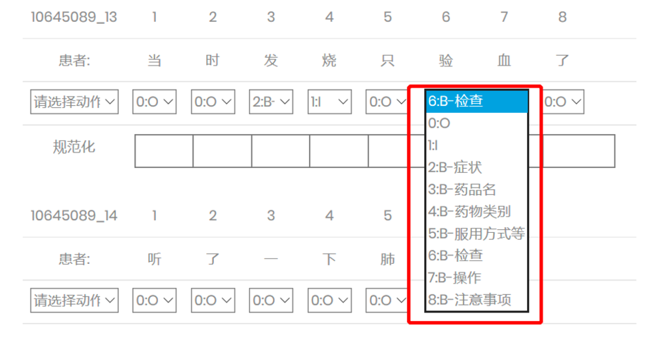
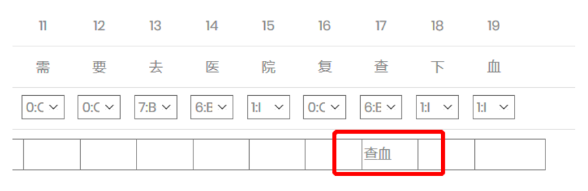

# A Medical Dialogue Annotation Tool

In this repository, we share a medical dialogue annotation tool. It is also the web-based tool that mentioned in the paper [A Benchmark for Automatic Medical Consultation System: Frameworks, Tasks and Datasets](https://arxiv.org/abs/2204.08997). The tool is based on Django that supports multi-level (**token-level**, **utterance-level** and **dialog-level**) annotation for medical dialogue.

Specifically, at the **token-level**, it supports to identify medical named entities by [BIO scheme](https://en.wikipedia.org/wiki/Inside%E2%80%93outside%E2%80%93beginning_(tagging)) and standardize them; at the **utterance-level**, it supports to classify each utterance (doctor's or patient's), which in our case refers to the dialog intent; at the **dialog-level**, it supports to collect medical reports, which are required to conform to a specific format and are manually written by annotators.

The project is jointly developed by `Qianyuan Yao` and `Hongyi Fang` from [Fudan DISC](http://fudan-disc.com/).

### Requirements

- python==3.8
- django==3.0
- pandas

### Django Setting

The project uses [sqlite](https://www.sqlite.org/index.html) database by default , you can change database settings in [medisite/settings.py](medisite/settings.py). 

### Django Administrator

Create a Django administrator account to access the database on [http://127.0.0.1:8000/admin/](http://127.0.0.1:8000/admin/). 

```shell
python manage.py createsuperuser
```

### Run Django Server

Run the annotation tool and log in [http://127.0.0.1:8000](http://127.0.0.1:8000) with the test account. 

- Username: test
- Password: test

```shell
python manage.py runserver
```

### Instructions

The project also provides a complete PDF document [here](login/static/files/标注规范.pdf) as instructions.

### User Interface

- Entity



- Entity Normalization



- Dialog Act


- Medical Report
- 


### How To Cite

If you extend or use this work, please cite the [paper]() where it was introduced.

```text
@article{chen2022benchmark,
  title={A Benchmark for Automatic Medical Consultation System: Frameworks, Tasks and Datasets},
  author={Chen, Wei and Li, Zhiwei and Fang, Hongyi and Yao, Qianyuan and Zhong, Cheng and Hao, Jianye and Zhang, Qi and Huang, Xuanjing and Wei, Zhongyu and others},
  journal={arXiv preprint arXiv:2204.08997},
  year={2022}
}
```
